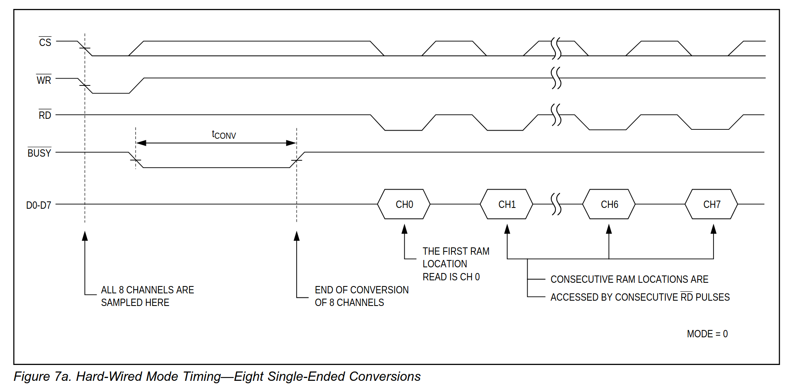

# Byggern

## Immediate TODO
- Rename print function to "printf". It seems to be used by the SRAM test function.
- Verify memory map implementation
- Implement address decoder using NAND-gates.
- Set the SRE bit in the MCUCR register (DONE)
- 

## Task 1
- Made USART support
- 9600 7N1 (7 databits, 1 stop bit)

## Task 2
 - Components
   - Latch ( 74ALS573 )c
   - 
   - SRAM IC ( IDT 7164 S20TPG)
   - A/D Converter
   - LCD display
   - Adress latch ( STK501 )
 - DEBUG
   - Latch-Enable (orange wire, LE) high --> Q=D. LE low --> Q is latched.
   - 

## Task 3
 - ADC
  - Vdd = 22
  - Vss = 4
  - CS = 5. CHIP SELECT Input must be low for the ADC to recognize RD, or WR.
  - RD = 6
  - WR = 7

  - It does not need any address lines as it will only
    receive data on the data bus, but it will need a chip select signal derived from the address bus using the address decoder implemented in the previous exercise.

  - The MAX156 does not have an
    internal clock, and require an external clock signal to work properly.

  - Conversions are initiated with a pulse to the WR pin, and data
    is accessed from the ADC’s RAM with a pulse to the RD pin.
  
  - To access conversion results, successive RD pulses auto-
    matically sence through RAM, beginning with channel 0.
    Each RD pulse increments the RAM address counter,
    which resets to 0 when WR goes low in multi channel
    conversions. An arbitrary RAM location may also be read
    by writing a 1 to INH while loading the RAM address (A0–
    A2), and then performing a read operation.

  - A PWM signal from the AtMega162 can be used as the ADCs external clock. Use PD4 or
    PD5 to avoid conflicts for later exercises.

  - Hard-wired connections of MODE and VSS select from 4 mux configurations as listed
    in Table 4 (see the Hard-Wired Mode section).

  - Configuration
    - MODE = 0, VSS = AGND (AGND is the ground potential, just connect it to GND on the     breadboard)

  - tCONV = (9 x N x 2)/fCLK
    where N is the number of channels converted.

    - 

- Left slider --> PWM PB4 
- Right slider --> PWM PD1

Filter setup
- PB4

- End-of-day: The joystick pcb is fucked. There is no signal coming out of PB4 and PD1. Double checked against another group's pcb.